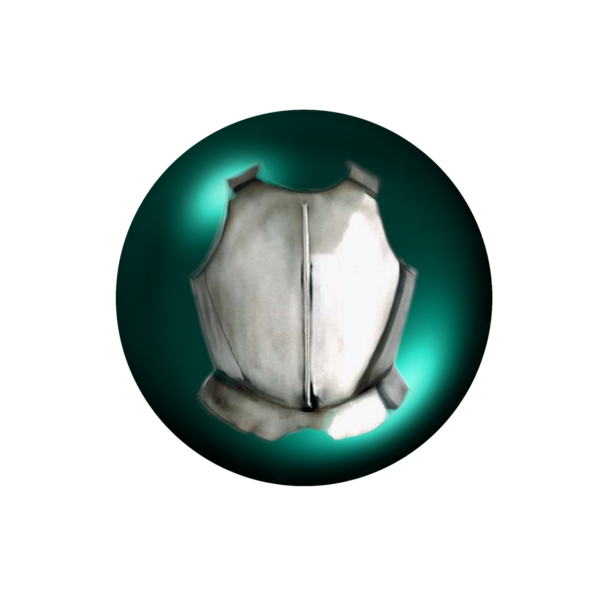

<h1 align="center">
  <br>
  <a href="https://github.com/its-kos/Enderman-armor-Minecraft-mod"></a>
  <br>
  Ender Armor
  <br>
</h1>

<p align="center">
  <a href="#key-features">Key Features</a> •
  <a href="#how-to-use">How To Use</a> •
  <a href="#download">Download</a> •
  <a href="#credits">Credits</a> •
  <a href="#related">Related</a> •
  <a href="#license">License</a>
</p>

<p align="center">
  
</p>

## Key Features

* New mechanics - (In development)
  - Receiving damage, getting shot, fall damage and many more new interactions
* Unique sound effects - (In development)
  - Equipping, using and repairing the armor plays different unique sound effects.
* New Mob interactions - (In development)
  - Certain mobs now interact with you in different ways.
* New crafting recipe - (In development)
  - This armor can be specially crafted using only nether items.


## How To Use

To use this mod you will need [Minecraft](https://www.minecraft.net/en-us/get-minecraft) and [Forge](https://apexminecrafthosting.com/how-to-install-mods-on-forge/).

1) Once you have both *Minecraft* and *Forge* installed, head to the [releases](https://github.com/its-kos/Enderman-armor-Minecraft-mod/releases) tab and download the latest release.
2) From the Minecraft launcher, enter the Installations tab at the top.
3) Hover over your Forge installation, then press the Open Folder icon to the right.
4) In the new window, locate or create a `mods` folder, then enter it.
5) Paste the mod `.jar` file(s) from earlier into this location.
6) Once done, return to the Minecraft launcher and press Play.

<p>Or</p> 

To build the `.jar` yourself:

```bash
# Clone this repository
$ git clone https://github.com/its-kos/Enderman-armor-Minecraft-mod.git

# Go into the repository
$ cd Enderman-armor-Minecraft-mod

# Initialize the Graddle wrapper
$ gradlew

# Run the `build` task to build the app using Graddle
$ gradlew build

# Navigate to the `build/lib` directory to find the `.jar` file (The mod)
$ cd build && cd libs
```

> **Note**
> If you're using Linux Bash for Windows, [see this guide](https://www.howtogeek.com/261575/how-to-run-graphical-linux-desktop-applications-from-windows-10s-bash-shell/) or use `node` from the command prompt.


## Download

You can [download](https://github.com/its-kos/Enderman-armor-Minecraft-mod/releases/tag/dev/v0.0.1-1.19.4) the latest installable version of `Ender armor` for Minecraft 1.19.4.

## Contributing

Any and all contributions are more than welcome! There are several ways you can contribute:
* Play with the mod, find bugs and things you wanna see improved and open an [issue](https://github.com/its-kos/Enderman-armor-Minecraft-mod/issues) 
* <a href="#how-to-use">Download and build</a> the mod yourself, fix bugs, make improvements and open a [pull request](https://github.com/its-kos/Enderman-armor-Minecraft-mod/pulls)
* **Artistic help will be seriously appreciated as I have no idea what i'm doing.** :grin:

## Related

[1](https://www.curseforge.com/minecraft/mc-mods) - Forge mod repository

[2](https://docs.minecraftforge.net/en/1.19.x/) - Forge docs

[3](https://forge.gemwire.uk/wiki/Main_Page) - More docs

## Support

Right now just contributing to this is more than enough! :grin:

## You may also like...

- [Volter Bot](https://github.com/its-kos/Lichess-VolterBot) - A lichess bot
- [Beat bot](https://github.com/its-kos/Beat-Bot) - A discord bot

## License

MIT

---

> GitHub [@its-kos](https://github.com/its-kos) &nbsp;&middot;&nbsp;

